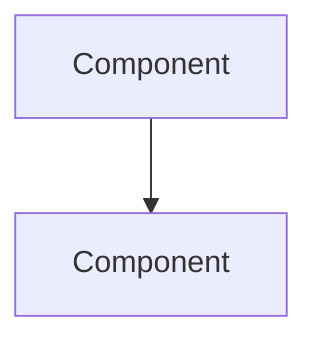

# NASA SE-Anchored Universal Technical Transfer Record (UTTR)

**Standard Track:** NASA/SP-2016-6105 Rev2 System Component Allocation  
**Authority:** NASA Systems Engineering Handbook NASA/SP-2016-6105 Rev2 — see `docs/nasa-sp-2016-6105-rev2.md`.

**Deployment Target (canonical):** Giscus comments on MkDocs docs pages  
(`https://shayanultra.github.io/planner/*` → GitHub Discussions storage)

**Output format (mandatory):** **GitHub-flavored Markdown only**

---

## Deprecated (do not use)

The following are **deprecated** and must **not** appear in agent UTTR output:

- Local browser single-file **split-pane** HTML interfaces
- Self-contained `.html` documents (`<!DOCTYPE html>`, `<html>`, `<head>`, `<style>`)
- CSS layout chrome (`uttr-grid`, `policy-pane`, `mechanism-pane`, badge spans as layout)
- “Compile feedback into an HTML block for split-pane rendering”
- Posting **HTML payloads** to Giscus / Discussions

Giscus renders **Markdown**. Raw HTML tags pollute the comment UI and are incompatible with the canonical delivery surface.

**Mechanism-not-policy** remains as **section semantics** (Policy sections vs Mechanism sections below), **not** as CSS panes.

---

## Part 1: Markdown UTTR schema (post this body)

Agents must compile each page transfer into **one Markdown comment body** matching this structure. Preserve all technical substance: citations, code, invariants, metrics, topology.

```markdown
# UTTR: RAGnaroX → Planner-AI — `<page_slug>`

**Research:** Dornauer & Racasan, *RAGnaroX*, arXiv:2604.03291 (2026)  
**Authority preserved:** `docs/goal.md` (vision non-mutation) · Raster2Seq geometry sole · C++ single-process ETE  
**Format:** NASA/SP-2016-6105 Rev2 UTTR (Markdown for Giscus)  
**Session:** <YYYY-MM-DD> · Patterns-only technology transfer · Zero product implementation  

## 1. Stakeholder Anchor [NASA 4.1]

**Component ID:** `<OCR-…>`

### 1.1 Source Document Locus

> Quoted or paraphrased locus from RAGnaroX / Planner-AI specs (cite section).

### 1.2 Immutable Policy Invariants [NASA 4.1.1.2]

- **Functional Guardrail:** …
- **Execution Bound:** …
- **Performance Floor:** …

### 1.3 Baseline System Allocation [NASA 4.1.2]

- **Workspace Context:** …
- **Primary Stack Target:** …
- **Data Sourcing Rules:** Geometry via Raster2Seq only; interactive planning via Grok-4.5 (or current stack note).

## 2. Technical Solution Alignment [NASA 5.2]

### 2.1 Value Delta & Scientific Basis

- **Proposed Mechanism:** …
- **Empirical Source Reference:** RAGnaroX §… [citations]
- **Primary Yield:** …

### 2.2 Policy Invariance Proof [NASA 4.1]

Illustrative check (fenced code; not a product commit):

```text
// or ```cpp — keep real identifiers from the transfer
```

## 3. Interface & Product Transition [NASA 4.3 / 5.1]

### 3.1 Component Topology [C4 Level 3]

Prefer a fenced mermaid block **or** a bullet topology — never HTML layout divs:



### 3.2 Architectural Interface Schema

Fenced code for structs / JSON contracts (content-preserving).

## 4. Product Implementation Blueprint [NASA 5.2.2]

### 4.1 Reference Integration (illustrative)

Fenced code only — patterns-only technology transfer; **zero product implementation** in-repo unless separately authorized.

## 5. Product Verification Matrix [NASA 5.3 & Table 5.3-1]

### 5.1 Formal Verification Method Selection

- **Mandated Method [NASA 5.3.1.2]:** …
- **Success Criterion:** …
- **Resource Boundary [NASA 4.2]:** …

## 6. Fault Management & Validation [NASA 6.4 & 5.4]

### 6.1 Degradation Vectors & Failure States

- **Vector A:** …
- **Vector B:** …

### 6.2 Deterministic Safety Fallback Protocol [NASA 6.4]

- **Trigger:** …
- **Recovery Path:** …

### 6.3 Systemic Validation Regression Check [NASA 5.4.1.2.3]

- **Target Verification Metric:** …

## Citations

- Minimum **20** direct, correct RAGnaroX citations mapped to identifiable Planner-AI loci (when running a full transfer session).
- Prefer arXiv:2604.03291 section anchors and local `planner-ai/RAGnaroX/ragnarox.md` paths.
```

---

## Part 2: Delivery rules (Giscus)

1. Read `docs/planner-docs/giscus_mapping.json` for `pages[slug].number` / `discussion_id`.
2. Post the **Markdown** body via GraphQL / `gh` / MCP (`github__discussion_comment_write`). Prefer MCP when fine-grained PAT lacks Discussions write.
3. **Do not** use browser automation to type into the Giscus widget.
4. **Success metric:** open `https://shayanultra.github.io/planner/<page>/`, scroll to Giscus, and read a **clean Markdown** UTTR (no raw HTML tags). Discussions URL is storage only.

Optional local helper:

```bash
docs/planner-docs/scripts/post_uttr_comment.sh \
  --page 01_goals_criteria \
  --body-file /path/to/uttr.md
```

Bodies containing pollution markers (`<!DOCTYPE`, `<style`, `uttr-grid`, `policy-pane`, `mechanism-pane`) must be rejected and rewritten as Markdown.

---

## Part 3: Session protocol (technology transfer only)

The objective of a transfer session is pure **Technology Transfer** of *RAGnaroX: A Secure, Local-Hosted ChatOps Assistant Using Small Language Models* (arXiv:2604.03291) into Planner-AI contract specs and engineering blueprint — **without** mutating Planner-AI’s core vision and **without** product implementation in that session.

```
@misc{dornauer2026ragnaroxsecurelocalhostedchatops,
      title={RAGnaroX: A Secure, Local-Hosted ChatOps Assistant Using Small Language Models},
      author={Benedikt Dornauer and Mircea-Cristian Racasan},
      year={2026},
      eprint={2604.03291},
      archivePrefix={arXiv},
      primaryClass={cs.AR},
      url={https://arxiv.org/abs/2604.03291},
}
```

### Two-step protocol

1. **ARCHITECTURAL DECOMPOSITION & ALIGNMENT:** Using the RAGnaroX paper as canonical source of truth, audit modular MkDocs pages. Format authority is this file (`docs/templates/uttr-blueprint.md`) plus NASA SE handbook (`docs/nasa-sp-2016-6105-rev2.md`). Every technical feedback block must follow the **Markdown UTTR schema** above (policy vs mechanism as **sections**, not HTML panes).

2. **ATOMIC DELTA INJECTION:** For every optimization opportunity that interfaces with a Planner-AI locus, compile a complete **Markdown** UTTR block and post it as a comment on the dedicated Giscus discussion for that page (via mapping + GraphQL/gh/MCP). Proofs, topology, and data contracts must show how Planner-AI can hit existing targets with architectural leverage from RAGnaroX.

### Access-point constraint

Do **not** use browser automation or headless UI to click Giscus inputs. Read `docs/planner-docs/giscus_mapping.json`, then inject **Markdown** UTTR payloads programmatically (GitHub GraphQL, `gh`, or authorized GitHub MCP).

### Sources

- GitHub: https://github.com/genius-itea/RAGnaroX.git · Local: `planner-ai/RAGnaroX`
- Paper PDF: https://arxiv.org/pdf/2604.03291  
- Paper HTML (source only, **not** output format): https://arxiv.org/html/2604.03291v1  
- Local Markdown: `planner-ai/RAGnaroX/ragnarox.md`  
- Data: `planner-ai/RAGnaroX/arXiv-2604.03291v1/data`
